To get contact with me, E-mail me at [📧](mailto:johncachy@amiverse.uk) :)


<!--START_SECTION:waka-->
**I'm a Night 🦉** 

```text
🌞 Morning                1 commits           ░░░░░░░░░░░░░░░░░░░░░░░░░   00.61 % 
🌆 Daytime                33 commits          █████░░░░░░░░░░░░░░░░░░░░   20.00 % 
🌃 Evening                82 commits          ████████████░░░░░░░░░░░░░   49.70 % 
🌙 Night                  49 commits          ███████░░░░░░░░░░░░░░░░░░   29.70 % 
```


📊 **This Week I Spent My Time On** 

```text
💬 Programming Languages: 
TypeScript               2 hrs 8 mins        █████░░░░░░░░░░░░░░░░░░░░   19.46 % 
Bash                     1 hr 59 mins        █████░░░░░░░░░░░░░░░░░░░░   18.14 % 
Markdown                 1 hr 41 mins        ████░░░░░░░░░░░░░░░░░░░░░   15.35 % 
JSON                     1 hr 33 mins        ████░░░░░░░░░░░░░░░░░░░░░   14.13 % 
Python                   1 hr 19 mins        ███░░░░░░░░░░░░░░░░░░░░░░   12.10 % 

🔥 Editors: 
VS Code                  10 hrs 38 mins      ████████████████████████░   96.57 % 
Windsurf                 16 mins             █░░░░░░░░░░░░░░░░░░░░░░░░   02.55 % 
Antigravity              5 mins              ░░░░░░░░░░░░░░░░░░░░░░░░░   00.89 % 
```

**I Mostly Code in Python** 

```text
Python                   8 repos             █████████░░░░░░░░░░░░░░░░   36.36 % 
TypeScript               6 repos             ███████░░░░░░░░░░░░░░░░░░   27.27 % 
JavaScript               2 repos             ██░░░░░░░░░░░░░░░░░░░░░░░   09.09 % 
Vue                      1 repo              █░░░░░░░░░░░░░░░░░░░░░░░░   04.55 % 
CSS                      1 repo              █░░░░░░░░░░░░░░░░░░░░░░░░   04.55 % 
```


 Last Updated on 21/03/2026 10:50:32 UTC
<!--END_SECTION:waka-->

if you like what i do, maybe consider buying me a coffee/tea 🥺👉👈

<a href="https://buymeacoffee.com/watanabetohru" target="_blank"></a>

🚧 **my todoist stats:**

<!-- TODO-IST:START -->
🏆 2113 Karma Points           
🌸 Completed 0 tasks today           
✅ Completed 64 tasks so far           
📋 20 tasks remaining
<!-- TODO-IST:END -->

📈 my github stats

<!-- GITHUB-STATS:START -->
<p align="center">
  
</p>
<!-- GITHUB-STATS:END -->


