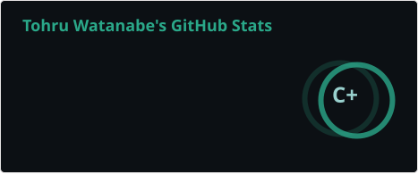

To get contact with me, E-mail me at [📧](mailto:watanabe_tohru@amiverse.uk) :)


<!--START_SECTION:waka-->


**I'm a Night 🦉** 

```text
🌞 Morning                3 commits           ░░░░░░░░░░░░░░░░░░░░░░░░░   01.36 % 
🌆 Daytime                46 commits          █████░░░░░░░░░░░░░░░░░░░░   20.91 % 
🌃 Evening                113 commits         █████████████░░░░░░░░░░░░   51.36 % 
🌙 Night                  58 commits          ███████░░░░░░░░░░░░░░░░░░   26.36 % 
```


📊 **This Week I Spent My Time On** 

```text
💬 Programming Languages: 
Markdown                 4 mins              █████████████░░░░░░░░░░░░   53.56 % 
JSON                     3 mins              ███████████░░░░░░░░░░░░░░   42.83 % 
JavaScript               0 secs              █░░░░░░░░░░░░░░░░░░░░░░░░   02.67 % 
YAML                     0 secs              ░░░░░░░░░░░░░░░░░░░░░░░░░   00.94 % 

🔥 Editors: 
VS Code                  9 mins              █████████████████████████   100.00 % 
```

🤖 **AI Coding This Week** 

```text
No AI Coding Activity Tracked This Week
```

**I Mostly Code in Python** 

```text
Python                   9 repos             ████████░░░░░░░░░░░░░░░░░   32.14 % 
TypeScript               9 repos             ████████░░░░░░░░░░░░░░░░░   32.14 % 
Vue                      2 repos             ██░░░░░░░░░░░░░░░░░░░░░░░   07.14 % 
JavaScript               2 repos             ██░░░░░░░░░░░░░░░░░░░░░░░   07.14 % 
Shell                    1 repo              █░░░░░░░░░░░░░░░░░░░░░░░░   03.57 % 
```


 Last Updated on 16/09/2026 15:05:55 UTC
<!--END_SECTION:waka-->

<!-- if you like what i do, maybe consider buying me a coffee/tea 🥺👉👈

<a href="https://buymeacoffee.com/watanabetohru" target="_blank"></a> -->

🚧 **my todoist stats:**

<!-- TODO-IST:START -->
🏆 2091 Karma Points           
🌸 Completed 0 tasks today           
✅ Completed 70 tasks so far           
📋 26 tasks remaining
<!-- TODO-IST:END -->

📈 my github stats

<!-- GITHUB-STATS:START -->
<p align="center">
  
</p>
<!-- GITHUB-STATS:END -->


